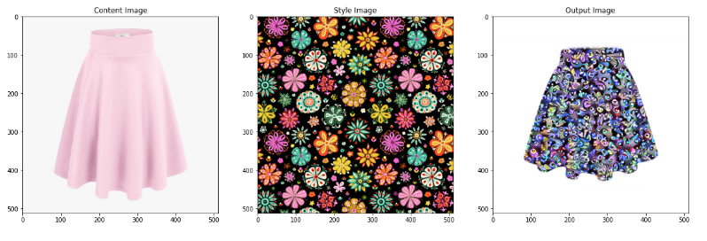

## FASHIONATOR
<p align="center">
  
</p>

Using the concepts of Neural Style Transfer we have created designs and apparels which are entirely new and aid the fashionistas as well as the designers to explore domains untouched by their imagination.

The user needs to upload two input images, one for the Base Apparel (for creating the shape) and the other for the Style Apparel (for creating the design and texture) and our model creates an entirely new design combining those in a clever way.


## Results





## Requirements
```
* Python
* Tensorflow
* OpenCV
```

